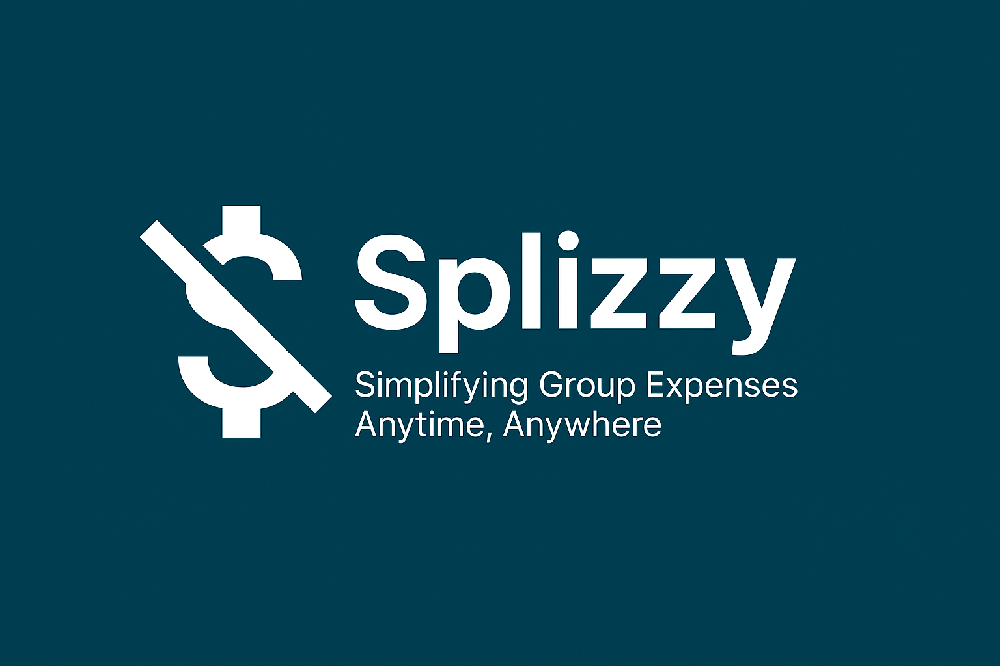

# Splizzy - Bill Splitting App

## Team Members
- Johann Rajosefa (300300054)
- Dera Ramiliarijaona (300148490)
- Matthieu Ramanitrera (300264295)

## Project Overview
Splizzy is a user-friendly mobile application designed to simplify the process of splitting expenses among groups. Whether you're dining out with friends, managing shared household costs, or planning a trip, Splizzy helps you track expenses, assign them to individuals, and calculate what each person owes — all in real-time.

## Features
- 👥 Group expense management
- 💰 Automatic expense splitting calculations
- 🔐 Secure user authentication
- 📱 Cross-platform support (iOS and Android)
- 🌐 Real-time data synchronization
- 🎨 Modern and intuitive user interface

## Technologies Used
### Frontend
- **Flutter**: Cross-platform mobile development framework
- **Provider**: State management solution
- **Google Fonts**: Typography
- **Flutter Launcher Icons**: App icon management

### Backend & Services
- **Firebase**: Backend as a Service (BaaS)
  - **Firestore**: Real-time database
  - **Firebase Authentication**: User authentication
  - **Google Sign-In**: Social authentication
- **OCR Integration**: For bill scanning and text extraction

### Development Tools
- Flutter SDK (^3.7.0)
- Dart SDK
- Android Studio / Xcode
- VS Code

## Getting Started

### Prerequisites
1. Flutter SDK installed on your machine
2. Firebase account
3. Android Studio or Xcode for emulation
4. Git for version control

### Installation
1. Clone the repository:
   ```bash
   git clone git@github.com:KugleBlitz007/SplitGasy.git

2. Install dependencies:
   ```bash
   flutter pub get
   ```

3. Set up Firebase:
   - Create a new Firebase project
   - Add your Android/iOS apps
   - Download and add the configuration files
   - Enable Authentication and Firestore

4. Configure environment variables:
   - Copy `.env.example` to `.env`
   - Add your Firebase configuration

5. Run the app:
   ```bash
   flutter run
   ```

## Project Structure
```
lib/
├── assets/         # Images, icons, and other static assets
├── components/     # Reusable UI components
├── Models/         # Data models
├── pages/          # Screen pages
├── providers/      # State management
├── services/       # Business logic and API services
└── main.dart       # Application entry point
```
## Future Enhancements

   📸 Bill scanning and OCR text recognition

   💵 Local currency support

   📤 Expense export (PDF/CSV)

   🔔 Push notifications for expense reminders
## Contributing
1. Fork the repository
2. Create your feature branch (`git checkout -b feature/AmazingFeature`)
3. Commit your changes (`git commit -m 'Add some AmazingFeature'`)
4. Push to the branch (`git push origin feature/AmazingFeature`)
5. Open a Pull Request


## Acknowledgments
- Flutter team for the amazing framework
- Firebase for the backend services
- All contributors and supporters of the project
